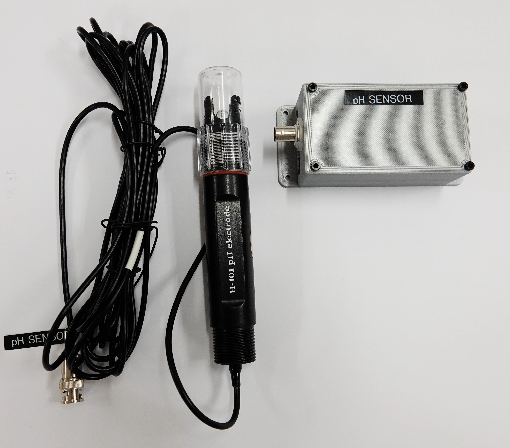
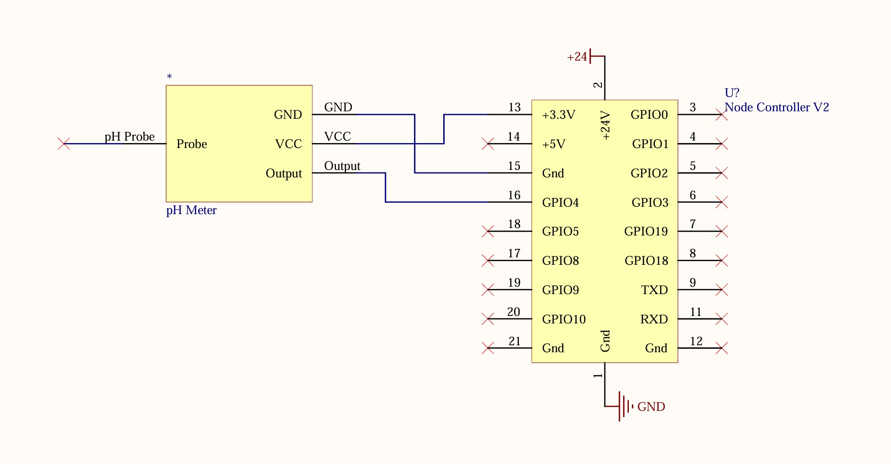

# Device pH Sensor(DFRobot)

The pH sensor(DFRobot) is a device to interface the a FRobot Gravity: Analog pH meter V2.
At this time, the sensor is not user calibrated; calibration is performed using a serial interface
on the node controller firmware.

## Hardware

## Firmware
### Message IDs and Format

To get a accurate temperature compensation, the firmware looks for tempeature data from node ID 162 and message ID 2572(tank temperature). This will be user configurable in the future. If no temperature data is available, the firmware will use a default temperature of 20 degrees Celsius.

| Parameter | Message ID | Data Format |
| --------- | ---------- | ----------- |
| pH value | 0x0A00 | 32-bit float |
| low pH alarm | 0x0A01 | 32-bit float |
| high pH alarm | 0x0A02 | 32-bit float |
| pH alarm on/off | 0x0A03 | bool on/off |